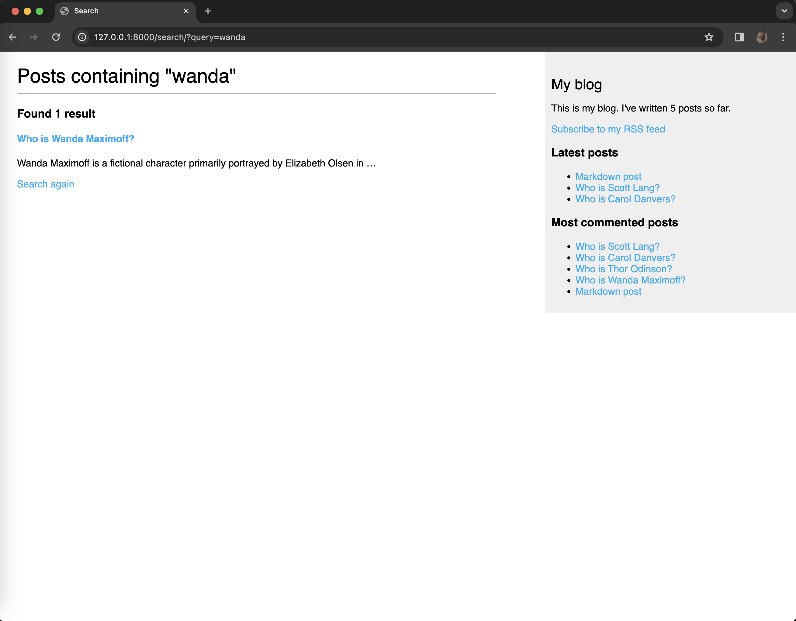
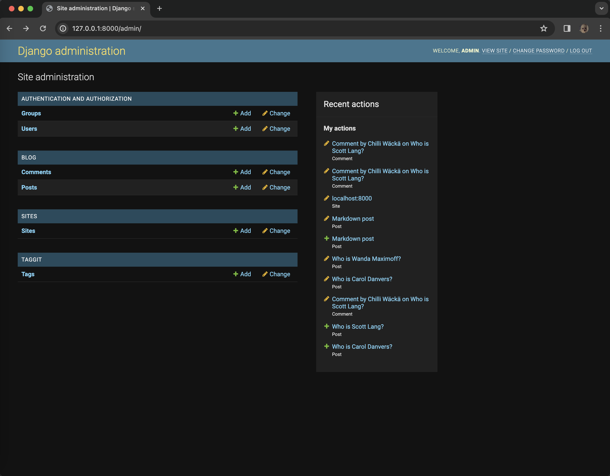

# mysite

This is the code repository for a blog application utilizing the Django framework.

## Instructions

The code is organized into directories and it has a `requirements.txt` file that includes all packages required to run the application. These can be installed with the command `pip install -r requirements.txt`.

## About the Project

**mysite** serves as my deliberate practice while guiding me through the entire process of developing professional web applications with Django. This application not only covers the most relevant aspects of the framework, but it also shows how to integrate other popular technologies into a Django project.

The code walks through the creation of a real-world application, solving common problems, and implementing best practices, using a step-by-step approach that is easy to follow.

After completing this project, it has given me a good understanding of how Django works and how to build practical, advanced web applications.

## Requirements

This project requires Python 3.10+ and Django 4.1.

## Django Project

This exercise covers a wide range of web app development topics as specified below:

- **Blog Application** : A complete blog application

  - Built data models, views, and URLs
  - Implemented an administration site for the blog
  - Used canonical URLs for models and implemented SEO-friendly URLs for posts
  - Built post pagination and created class-based views
  - Used forms to allow readers to share posts via email and implemented a comment system using model forms
  - Added tags to posts using [django-taggit](https://github.com/jazzband/django-taggit) and recommended similar posts based on shared tags
  - Implemented custom template tags to display latest posts and most commented posts
  - Implemented a custom template filter to render [Markdown](https://github.com/Python-Markdown/markdown)
  - Created a sitemap and a RSS feed for the blog
  - Implemented a full-text search engine using PostgreSQL

#### main page

#### adding a comment

#### sharing by e-mail

#### searching for a post

#### viewing the RSS feed via Fluent Reader

#### admin page

